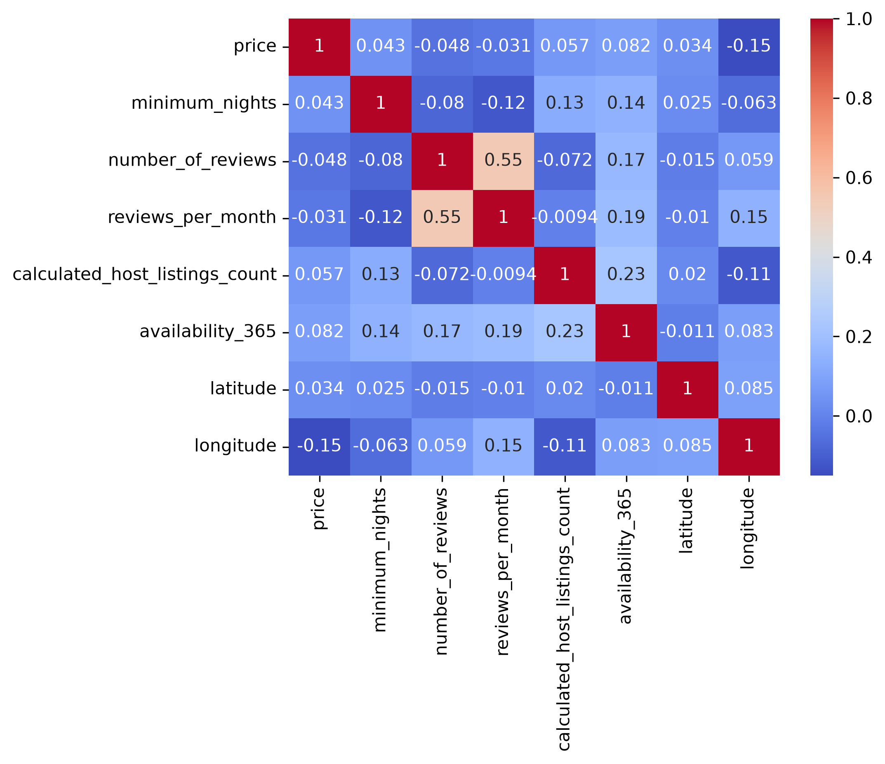
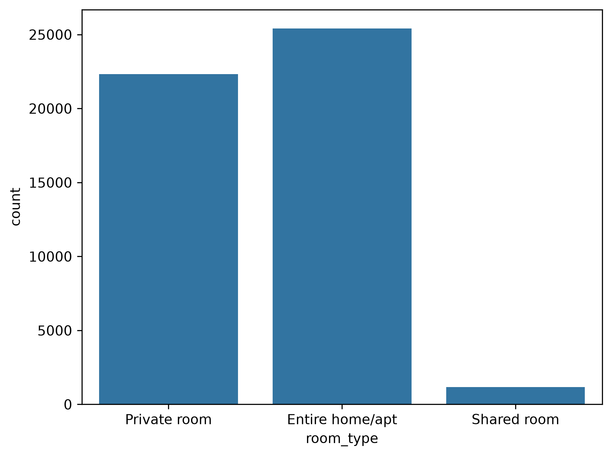
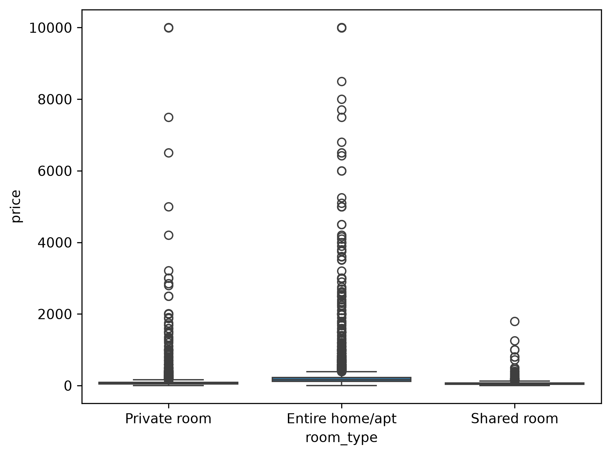
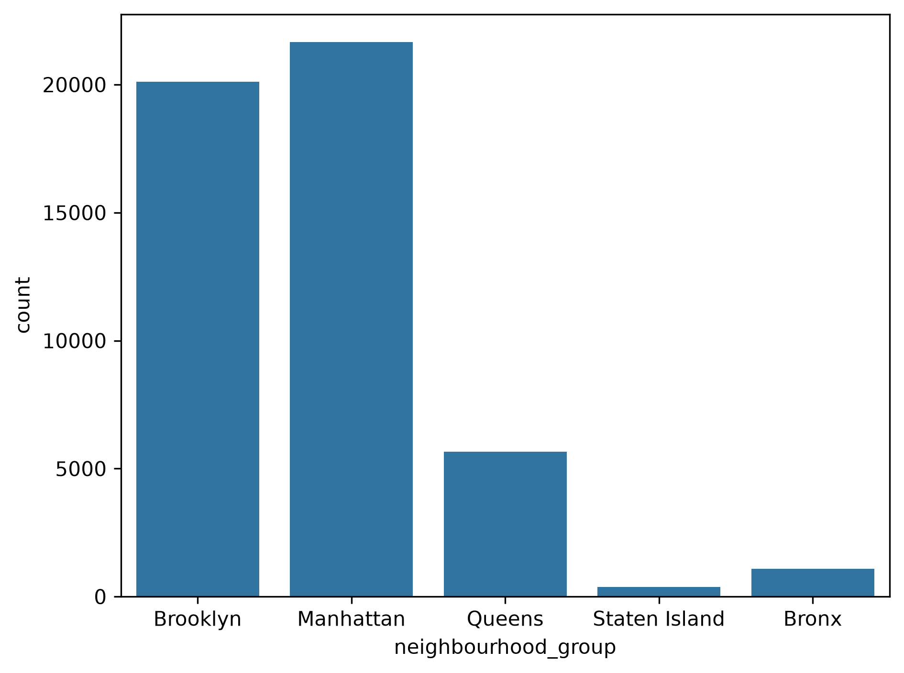
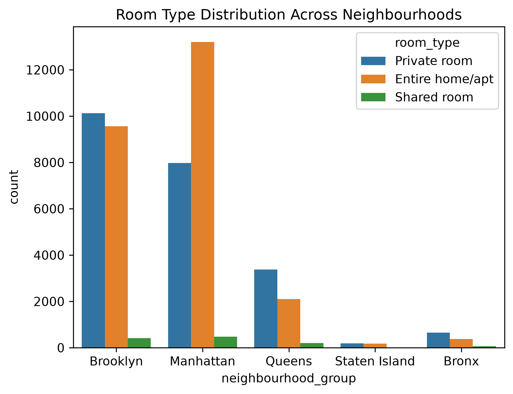
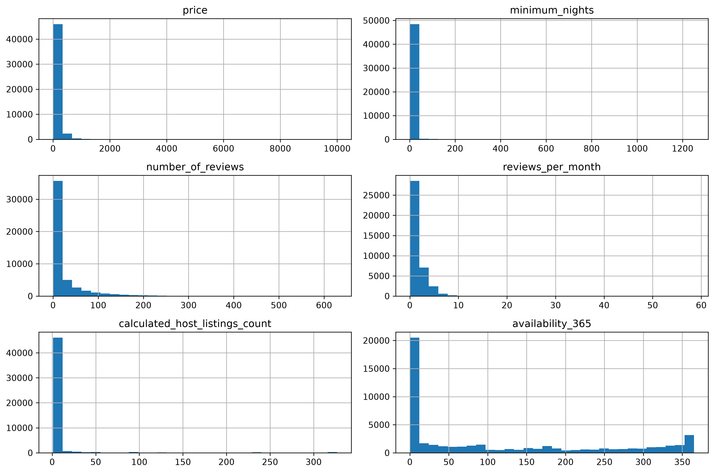
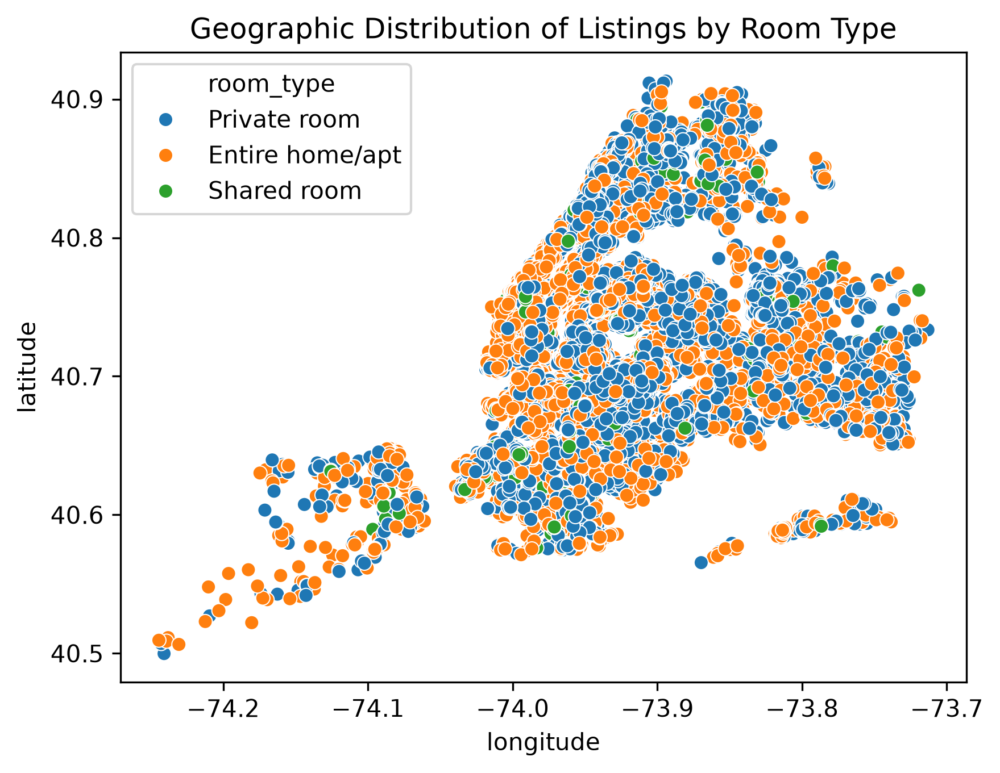

<div align="center">

# 🏙️ NYC Airbnb Room Type Predictor

**A FastAPI machine learning web app that predicts whether an NYC Airbnb listing
is an Entire Home, a Private Room, or a Shared Room — plus a full personal
portfolio site built around it.**

[](https://www.python.org/)
[](https://fastapi.tiangolo.com/)
[](https://scikit-learn.org/)
[](#-model)
[](LICENSE)

[Live Demo](#) · [Report a Bug](../../issues) · [Request a Feature](../../issues)

</div>

---

## 📖 Overview

This project trains a classification pipeline on 47,975 NYC Airbnb listings to
predict a listing's **room type** — Entire home/apt, Private room, or Shared
room — from its location, price, and host/review signals, reaching **82%
accuracy** on held-out data. The model is served live through a **FastAPI**
backend with a clean, self-contained multi-page front end — no separate
hosting for the UI and the API.

It's also set up as a small personal site: alongside the predictor there's an
**About**, **Projects**, and **Contact** page, so the model isn't just a demo —
it's the centerpiece of a working portfolio.

## ✨ Features

- 🔮 **Live prediction** — enter a listing's details and get a room-type
  prediction with class probabilities, rendered instantly.
- ⚡ **FastAPI backend** — a typed, validated `/api/predict` endpoint with
  auto-generated Swagger docs at `/docs`.
- 🎨 **Custom UI** — a dark, NYC-skyline-themed interface built with Jinja2
  templates and vanilla JS/CSS (no frontend framework required).
- 📊 **EDA included** — exploratory analysis and graphs from the training
  notebook are surfaced on the Projects page.
- 🧭 **Multi-page site** — Home (predictor), About, Projects, Contact, all
  served from one app.
- 📱 **Responsive** — works from desktop down to mobile, with a collapsible
  nav menu.

## 🖥️ Pages

| Route | Description |
|---|---|
| `/` | The room-type predictor |
| `/about` | Background, skills, and focus areas |
| `/projects` | This project's EDA + other ML/DS projects |
| `/contact` | LinkedIn, GitHub, and email |
| `/api/predict` | `POST` — JSON prediction endpoint |
| `/api/health` | `GET` — liveness check |
| `/docs` | Interactive Swagger API docs |

## 🧠 Model

| | |
|---|---|
| **Task** | Multi-class classification (3 classes) |
| **Algorithm** | Random Forest, inside a scikit-learn `Pipeline` |
| **Preprocessing** | Median/most-frequent imputation → Yeo-Johnson power transform → standard scaling (numeric); one-hot encoding (categorical) |
| **Features** | latitude, longitude, price, minimum nights, number of reviews, reviews per month, host listing count, availability, borough, neighbourhood |
| **Accuracy** | **82.0%** on a held-out test split |
| **F1 Score (macro)** | **0.69** — averaged evenly across all 3 classes, including the minority "Shared room" class |
| **Dataset** | [NYC Airbnb Open Data](https://www.kaggle.com/datasets/dgomonov/new-york-city-airbnb-open-data) — 47,975 cleaned listings |
| **Class balance** | Entire home/apt: 24,736 · Private room: 22,098 · Shared room: 1,141 |
| **Train/test split** | 67% / 33%, stratified by class, `random_state=42` |

Training and evaluation are in [`notebooks/model_train.ipynb`](notebooks/model_train.ipynb);
exploratory analysis is in [`notebooks/nyc_airbnb_eda.ipynb`](notebooks/nyc_airbnb_eda.ipynb).

## 📊 Exploratory Data Analysis

All plots below were generated from `notebooks/nyc_airbnb_eda.ipynb` and are also
viewable on the live site's [Projects page](#).

<table>
<tr>
<td width="50%">

**Correlation heatmap**

Relationships between numeric features — price, reviews, availability, and
host listing count.

</td>
<td width="50%">

**Room type distribution**

Class balance across the three target labels — clearly imbalanced toward
Entire home/apt and Private room.

</td>
</tr>
<tr>
<td width="50%">

**Room type breakdown**

A closer look at how room types compare across the dataset.

</td>
<td width="50%">

**Listings by borough**

Manhattan and Brooklyn dominate listing volume; Staten Island has the fewest.

</td>
</tr>
<tr>
<td width="50%">

**Room type by neighbourhood**

How room type mix shifts across different NYC neighbourhoods.

</td>
<td width="50%">

**Numeric feature distributions**

Distribution shapes for price, minimum nights, reviews, and availability
before transformation.

</td>
</tr>
<tr>
<td width="50%">

**Listings by location**

Every listing plotted by latitude/longitude, colored by room type — the
shape of NYC itself emerges from the data.

</td>
<td width="50%">

</td>
</tr>
</table>

## 🛠️ Tech Stack

**Backend:** Python, FastAPI, Pydantic, Uvicorn
**ML:** scikit-learn, Pandas, joblib
**Frontend:** Jinja2, HTML5, CSS3, vanilla JavaScript
**Tooling:** Jupyter, Matplotlib, Seaborn

## 📂 Project Structure

```
.
├── main.py                 # FastAPI app: page routes + /api/predict + /api/health
├── requirements.txt
├── model/
│   └── Model_pipeline.pkl  # trained scikit-learn pipeline
├── templates/               # Jinja2 HTML templates
│   ├── base.html
│   ├── home.html
│   ├── about.html
│   ├── projects.html
│   └── contact.html
├── static/
│   ├── css/site.css
│   ├── js/app.js
│   ├── js/predictor.js
│   └── images/
├── data/                    # raw + cleaned training data
├── notebooks/                # EDA + model training notebooks
└── graphs/                   # EDA output images
```

## 🚀 Getting Started

### Prerequisites
- Python 3.10+

### Installation & run

```bash
# 1. Clone the repo
git clone https://github.com/musfirah-kashan/nyc-house-types-classification.git
cd nyc-house-types-classification

# 2. Create and activate a virtual environment
python -m venv .venv
source .venv/bin/activate        # Windows: .venv\Scripts\activate

# 3. Install dependencies
pip install -r requirements.txt

# 4. Run the app
uvicorn main:app --reload
```

Open **http://127.0.0.1:8000** in your browser. API docs are at
**http://127.0.0.1:8000/docs**.

## 🌐 Deployment

The app is a standard FastAPI/Uvicorn service, so it deploys as-is to
**Render**, **Railway**, **Fly.io**, or any host that runs a Python web
service. Set the start command to:

```bash
uvicorn main:app --host 0.0.0.0 --port $PORT
```

No environment variables are required.

## 🗺️ Roadmap

- [ ] Add automated tests for the `/api/predict` endpoint
- [ ] Add a map view for entering listing coordinates visually
- [ ] Dockerfile for containerized deployment

## 🤝 Contributing

Contributions, issues, and feature requests are welcome. Feel free to check
the [issues page](../../issues).

## 📄 License

Distributed under the MIT License. See `LICENSE` for more information.

## 📬 Contact

**Musfirah Kashan** — Full Stack Developer · Data Science · AI/ML · Software
Engineering student @ NED (Class of 2029)

[LinkedIn](https://www.linkedin.com/in/musfirah-kashan-487aa626a/) ·
[GitHub](https://github.com/musfirah-kashan)

---
<div align="center">
⭐️ If you found this project useful, consider giving it a star!
</div>